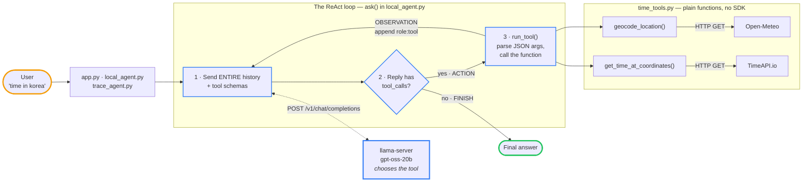

# simple-react-loop

A tiny, framework-free ReAct agent for local LLMs — with a trace mode that shows every
reasoning step and tool call.

The loop is the point; the demo task is answering "what time is it in X?" by chaining two
tools. It runs a **ReAct** cycle — reason, act, observe, repeat — using native tool calling
rather than the original paper's text parsing:

```
Thought      "Likely South Korea. Use geocode_location."
Action       geocode_location({"location_name": "Korea"})
Observation  Koréa, Ivory Coast ... Africa/Abidjan
Thought      "That's wrong. We need South Korea."
Action       geocode_location({"location_name": "South Korea"})
Observation  South Korea ... Asia/Seoul
Thought      -> final answer
```

That self-correction isn't scripted — no code sequences the calls. The model chose to retry
after reading a bad result. `trace_agent.py` prints all of it.

## Architecture



The model never touches an API. It emits a JSON tool call and stops; **your Python** parses
it, runs the function, makes the HTTP request, and appends the result to history. Steps 1-3
repeat until the model replies without a tool call.

## Two agents, one set of tools

| File | What | Needs |
|---|---|---|
| `app.py` | web chat UI (Flask) on the local model | a running server |
| `local_agent.py` | terminal chat on the local model | a running server |
| `agent.py` | terminal chat on Claude (`claude-opus-5`) | `ANTHROPIC_API_KEY` in `.env` |
| `trace_agent.py` | one query, every step printed | a running server |

They all import the same `time_tools.py`. Only the loop differs — which is the point: tools are
plain functions, and the provider is swappable around them.

## Setup

```bash
.venv/bin/python app.py                              # web UI -> http://localhost:5001
.venv/bin/python local_agent.py                      # same thing, in the terminal
cp .env.example .env && .venv/bin/python agent.py    # Claude version
```

Port 5001, not 5000 — macOS AirPlay Receiver occupies 5000.

Rebuild the venv with `python3.12 -m venv .venv && .venv/bin/pip install -r requirements.txt`.
Point `local_agent.py` somewhere else with `LOCAL_BASE_URL` / `LOCAL_MODEL` in `.env`.

## Seeing what actually happens

```bash
.venv/bin/python trace_agent.py "time in korea"
```

Runs a single query and prints every round trip: the model's own reasoning, the raw JSON
tool call it emits, the real outbound HTTP request, what came back, and how the token
count grows each round. The best way to understand the loop.

## The tools

`time_tools.py` holds two plain Python functions — no SDK imports:

| Function | Calls | Returns |
|---|---|---|
| `geocode_location(name)` | Open-Meteo geocoding | coordinates + timezone |
| `get_time_at_coordinates(lat, lon)` | TimeAPI.io | current local time |

Test them without any model: `.venv/bin/python time_tools.py`. Costs nothing, and isolates
API breakage from agent bugs.

## How the two loops differ

**`agent.py`** wraps each function in `@beta_tool`, which generates the JSON schema from the
signature, type hints, and docstring. `client.beta.messages.tool_runner(...)` then runs the
whole loop — executing tools and feeding results back — until Claude writes a final answer.

**`local_agent.py`** writes the schemas out by hand (the OpenAI-compatible API has no
generator) and runs the loop itself: call the model, check `message.tool_calls`, execute,
append a `role: "tool"` message, repeat. Capped at `MAX_STEPS` so a confused model can't spin.

Either way the tool descriptions are prompt text — that's what the model reads when deciding
what to call. A vague description produces wrong tool calls.

A turn looks like:

```
you> what time is it at the grand canyon?
  -> geocode_location(location_name='Grand Canyon')
  -> get_time_at_coordinates(latitude=36.05443, longitude=-112.13934)

It's 6:41 PM on Monday, September 14 at the Grand Canyon (America/Phoenix).
```

Nothing hardcodes that order. The model chains the two because the first one's output is
what the second one needs.

## Things to try

- Ask about somewhere ambiguous ("Springfield") and see which one it picks.
- Delete a tool description and watch the calls get worse.
- Add a third tool: write the function, then add it to `TOOL_FUNCTIONS` + `TOOL_SCHEMAS`
  (local) or `TOOLS` (Claude).
